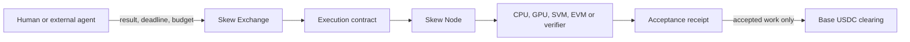

# Skew

**A real-time work exchange for humans, agents, and machines.**

Describe the result you need. Set a budget and a deadline. Skew finds eligible
compute, verifies the delivered result, and releases payment only after the
acceptance rule is satisfied.

[Open Skew](https://skew.deals) · [Architecture](docs/architecture.md) ·
[Protocol overview](docs/protocol-overview.md) · [Current status](docs/status.md)

## One market, two sides

**Request work**

People and external agents buy a completed result. They do not have to choose a
GPU model, cloud, region, RPC provider, or execution host.

**Offer a machine**

Owners connect a compatible computer, choose when it may work, and set an
earnings floor. The machine receives only work that fits its measured
capabilities and the owner's policy.



The traded unit is not a server hour. It is:

```text
job × deadline × accepted result × committed price
```

## Why this is an exchange

A request can come from a person, an external agent, or an admitted economic
event. Machines compete on the ability to complete that exact work before its
deadline. Skew binds the winning capacity to the job, preserves the receipt
chain through retries and failover, and clears only verified contributions.

Skew does not operate user agents or trading strategies. Discovery and ranking
can suggest work; only a funded, signed intent can authorize execution or
payment.

## Base

Base is the first settlement home for paid work. A Base job keeps its budget,
refund, and payout obligations on `eip155:8453`; execution may use different
machines or engines, but a scheduler cannot silently move the payment home.
x402 is an optional machine-payment adapter, not the source of result truth.

See [Base integration](docs/base.md) for the exact boundary between request,
acceptance, and settlement.

## Repository map

- [Architecture](docs/architecture.md) — control plane, data plane, receipt spine, and multichain boundary
- [Protocol overview](docs/protocol-overview.md) — the objects and transitions that make one job auditable
- [Security model](docs/security-model.md) — authorities, failure model, and fail-closed rules
- [Base integration](docs/base.md) — Base USDC and x402 adapter boundaries
- [Current status](docs/status.md) — what exists, what is experimental, and what is not live
- [Public examples](examples/) — an illustrative work intent, contract, and acceptance receipt
- [Prior research](docs/research/) — preserved engineering work that predates the current product

Run the zero-dependency example check:

```bash
npm test
```

## Development boundary

This repository is the public product and protocol overview. The performance
ranker, provider pricing model, production control plane, signer services,
deployment playbooks, and live economic data remain private while the system
is pre-audit. Public examples are fixtures, not evidence of a mainnet payment.

Skew is under active development. Do not use it to move real funds. See
[SECURITY.md](SECURITY.md) before reporting a vulnerability.
