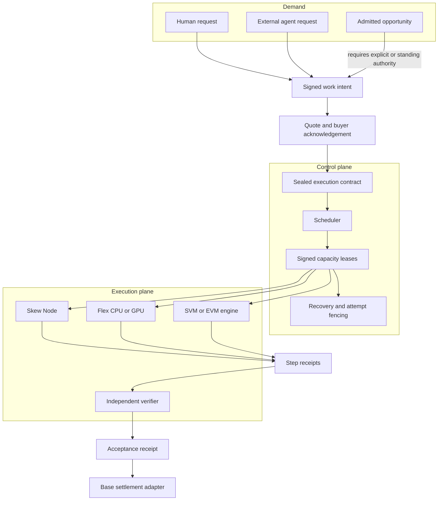

# Architecture

Skew turns a desired result into an accepted execution receipt. The exchange
coordinates the work; it does not become the authority for a user's wallet or
for the meaning of the result.

## System view



## Three planes

### Market plane

The market receives explicit demand and reviewable opportunities. It prices the
complete accepted result and selects eligible supply. Ranking has no signing,
dispatch, acceptance, or payout authority.

### Execution plane

A Skew Node exposes measured capability. A job may compile into a continuation
graph across deterministic VM, CPU, GPU, state, and verification steps. An
external result re-enters a deterministic flow only through a bounded receipt.

Skew Node uses a tile-oriented design influenced by high-performance validator
clients: bounded queues, explicit ownership, backpressure, isolated workers,
and recoverable state transitions. This is an engineering design choice, not a
claim of validator throughput.

### Economic plane

The budget is committed before paid execution. The contract fixes the payment
home, maximum debit, refund rule, protocol fee, and contribution policy.
Acceptance creates payout eligibility; it does not by itself prove that an
onchain payout has settled.

## Receipt spine

```text
Work Intent
  → Quote
  → Buyer Acknowledgement
  → Execution Contract
  → Capacity Lease
  → Attempt / Step Receipts
  → Verification Evidence
  → Acceptance Receipt
  → Settlement Receipt
```

Every transition is content-addressed and scoped to a versioned domain. A retry
creates a new attempt identity; it cannot replace the economic identity of the
job. A late or duplicated result cannot create a second payable effect.

## Multichain boundary

Chains sell state, commitments, blockspace, and settlement. Physical machines
sell CPU, GPU, memory, storage, bandwidth, and VM execution. Skew does not claim
that an idle blockchain supplies physical compute.

```text
Base      settlement home and EVM state
Solana    SVM-compatible state and settlement adapter candidate
BNB       EVM state and opportunity source candidate
Ethereum  EVM state, verification and final settlement source
Flex      physical CPU and GPU execution
```

A job may use several venues, but its requester-signed settlement home remains
fixed. Cross-chain routing cannot expand wallet authority.
