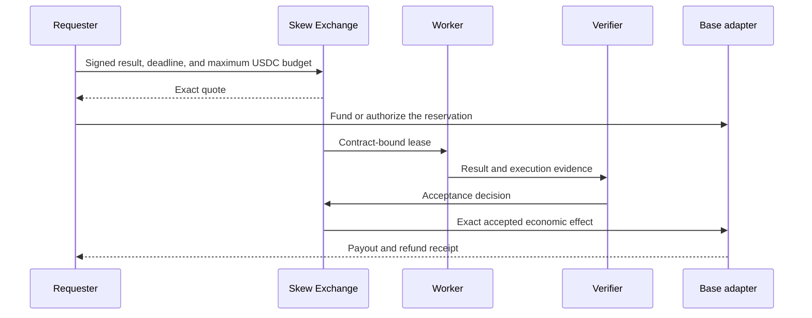

# Base integration

Base is Skew's first payment home for accepted machine work.

## Why Base

Base uses the CAIP-2 identifier `eip155:8453`. Coinbase's x402 v2 tooling uses
the same identifier and supports programmatic payments on Base. That makes Base
a natural first rail for human and agent demand without making x402 the source
of execution truth.

Official references:

- [Base network information](https://docs.base.org/base-chain/network-information/base-contracts)
- [x402 overview](https://docs.cdp.coinbase.com/x402/welcome)
- [x402 network support](https://docs.cdp.coinbase.com/x402/network-support)

## Economic flow

## Fixed settlement home

Once a requester signs a Base settlement policy, neither the scheduler nor an
execution venue can move the obligation to another network. Multichain state
and compute may contribute to the result, while budget, payout, and refund stay
bound to Base.

## x402 boundary

x402 can carry a price requirement and machine payment over HTTP. Skew adds the
longer-lived execution contract: deadline, immutable input, leased capacity,
retries, outcome verification, contribution accounting, and refund. An x402
payment is not an Acceptance Receipt, and a completed worker response is not a
settled payment.

## Activation status

Base mainnet payment is not presented as live in this repository. Production
activation requires an audited escrow or settlement contract, isolated signer,
limited funded canary, monitoring, replay-safe reconciliation, and a tested
refund path. See [Current status](status.md).

## Public review source

The review repository includes the [Base compute escrow, route registry,
receipt verifier, and contract tests](../contracts/). These contracts are
pre-audit and are not presented as a live Base mainnet deployment.
